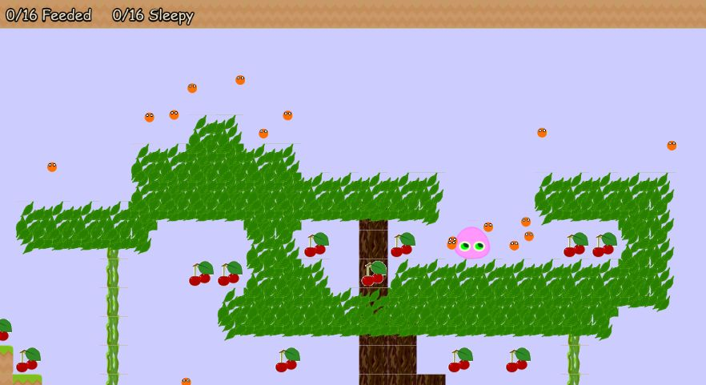
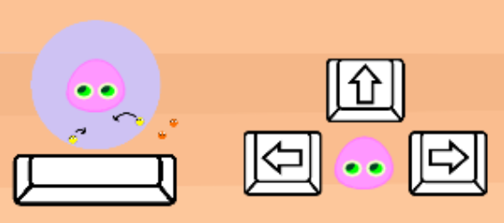
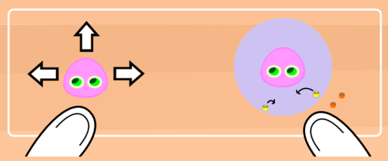

# Tiny Followers

This game was made for LUDUM DARE #56 (October 2024) in "COMPO" category  
Theme: "Tiny Creatures"  
https://ldjam.com/events/ludum-dare/56/tiny-followers

Framework: Phaser 3.85  
Language: TypeScript  
Tool: VS Code, Krita, Inkscape  

## [Play in your web browser at Itch.io](https://patbgames.itch.io/ld56-tiny-followers)   

## [Post-JAM version (Desktop/Android/IOS)](https://patbgames.itch.io/ld56-post-jam-tiny-followers)   

## Play instructions
Call the tiny creatures that are in range, feed them and put them to bed in the nest.   
 

## Controls
* Arrow keys: move left/right and jump   
* Space bar: hold to call the tiny creatures in range   
    

* Touch controls for mobiles   
    
